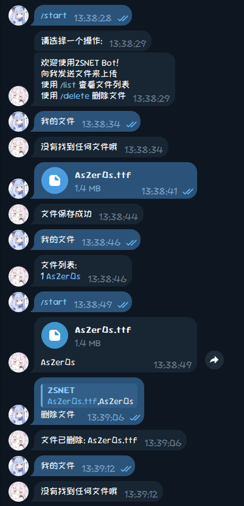

## TelegramFilesBot

You can download the latest releases version in [Actions](https://github.com/AsZer0s/TelegramFilesBot/actions/)



config.json
```json
{
    "botToken": "You_Bot_Token",
    "botUsername": "You_Bot_Username",
    "privateChatID": 0,
    "cacheFilePath": "file_cache.json"
}
```